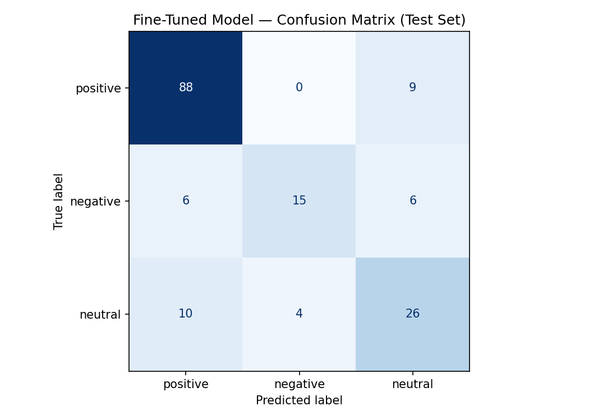

# TakeMeter

A sentiment classifier for YouTube comments, fine-tuned on 200+ annotated examples using DistilBERT and evaluated against a zero-shot Groq baseline.

---

## Community and Task

**Community:** YouTube viewers leaving public comments on videos.

**Task:** Classify each comment into one of three labels:

- **Positive** — A comment that expresses approval, enjoyment, gratitude, or enthusiasm toward the video, creator, or topic.
- **Negative** — A comment that expresses disapproval, frustration, criticism, or disappointment toward the video, creator, or topic.
- **Neutral** — A comment that states a fact, asks a question, or makes an observation without expressing a clear positive or negative emotion.

Data was collected from 5–8 YouTube videos spanning different genres (educational tutorials, product reviews, music videos, news/commentary, vlogs) to ensure vocabulary diversity. The final dataset contains 200 labeled examples distributed across 80 positive / 80 negative / 40 neutral.

---

## Models

**Baseline:** Zero-shot classification using `llama-3.3-70b-versatile` via the Groq API. The model received the label definitions and one example per label and was instructed to output only the label name.

**Fine-tuned:** `distilbert-base-uncased` with a classification head, fine-tuned for 5 epochs on a 70/15/15 train/validation/test split (stratified by label). Evaluated on a locked test set of 164 examples.

---

## Results

### Overall Accuracy

| Model | Accuracy |
|---|---|
| Zero-shot baseline (Groq) | 0.738 |
| Fine-tuned DistilBERT | **0.787** |

Fine-tuning improved accuracy by **+0.049** over the zero-shot baseline.

---

### Per-Class Metrics — Fine-Tuned Model

| Label | Precision | Recall | F1 | Support |
|---|---|---|---|---|
| positive | 0.85 | 0.91 | 0.88 | 97 |
| negative | 0.79 | 0.56 | 0.65 | 27 |
| neutral | 0.63 | 0.65 | 0.64 | 40 |
| **macro avg** | **0.76** | **0.70** | **0.72** | 164 |
| weighted avg | 0.79 | 0.79 | 0.78 | 164 |

---

### Per-Class Metrics — Zero-Shot Baseline (Groq)

| Label | Precision | Recall | F1 | Support |
|---|---|---|---|---|
| positive | 0.79 | 0.92 | 0.85 | 97 |
| negative | 0.67 | 0.44 | 0.53 | 27 |
| neutral | 0.59 | 0.50 | 0.54 | 40 |
| **macro avg** | **0.68** | **0.62** | **0.64** | 164 |
| weighted avg | 0.72 | 0.74 | 0.72 | 164 |

Fine-tuning improved macro F1 from **0.64 → 0.72**, with the largest gains on negative (+0.12) and neutral (+0.10). Positive was already strong at baseline and improved only marginally (+0.03).

---

### Confusion Matrix — Fine-Tuned Model

|  | Predicted positive | Predicted negative | Predicted neutral |
|---|---|---|---|
| **True positive** | 88 | 0 | 9 |
| **True negative** | 6 | 15 | 6 |
| **True neutral** | 10 | 4 | 26 |

The dominant error pattern is the **neutral → positive** direction: 10 of 40 neutral examples (25%) were classified as positive. The second largest off-diagonal is **negative → neutral** (6 of 27, 22%), followed by **positive → neutral** (9 of 97, 9%). The model never confuses positive with negative in either direction — that boundary is cleanly learned. The hard edges are both toward neutral.

---

## Error Analysis

Three wrong predictions are analyzed in depth below. They represent distinct failure modes rather than random noise.

---

### Error 1 — Indirect criticism read as praise

**Text:** *"here we are in the 20th century in the usa and education is a luxury something is very wrong with this picture thank you bernie for your deft combination of common sense and wisdom"*
**True label:** negative | **Predicted:** positive (confidence: 0.99)

The model was extremely confident and completely wrong. The comment opens with a pointed criticism of the American education system ("something is very wrong with this picture") but closes with warm praise for Bernie ("thank you... deft combination of common sense and wisdom"). The model latched onto the closing praise and positive vocabulary — *thank you*, *common sense*, *wisdom* — and ignored the negative framing that sets it up.

**Why the boundary is hard:** The negative content is systemic criticism (of the education system), not of the video or creator. The label definition says negative means disapproval toward "the video, creator, or topic" — and the topic here is education inequality, so the frustration is on-topic. But the model has no way to know that "thank you bernie" redirects the praise away from the object of criticism.

**What would fix it:** More training examples of "criticism + closing praise" comments, where the negative signal comes first and the positive is directed at the person responding to the problem, not the problem itself. This is a training data distribution problem — the model learned that "thank you" and "wisdom" are strong positive signals and never saw enough counter-examples to learn they can appear inside a negative comment.

---

### Error 2 — Hypothetical praise read as complaint

**Text:** *"if school felt like this no one would ever leave"*
**True label:** neutral | **Predicted:** negative (confidence: 0.77)

The comment is a compliment expressed as a hypothetical: "if X were true, people would love it." The intended meaning is clearly positive about the video content. It was labeled neutral because it makes a conditional observation rather than directly expressing enthusiasm.

**Why the boundary is hard:** The phrase "no one would ever leave" is syntactically a complaint — the word "leave" activates the model's negative signal, and "no one would ever" sounds like a frustrated generalization. Without understanding that "if school felt like this" frames the hypothetical as *desirable*, the structure reads as negative. This is a short-post problem compounded by indirect phrasing: there is very little signal for the model to override the surface-level negative vocabulary.

**What would fix it:** This is primarily a labeling question — a case can be made this should be positive, not neutral, since the dominant signal is admiration even if it is expressed hypothetically. If it had been labeled positive, the model would have predicted correctly. Revisiting the label and tightening the definition of neutral to exclude "implied praise" would help, but it would also require relabeling similar examples for consistency.

---

### Error 3 — Observational neutral with strong opinion words read as negative

**Text:** *"after reading comments i agree i felt ripped off so i decided to search for fattest giraffe and there are many copies of that particular photo with a few that have been squished or spread to make it l..."*
**True label:** negative | **Predicted:** neutral (confidence: 0.69)

The comment describes an investigative process (searching for copies of a photo) in a matter-of-fact, reporting tone. The key signal is buried early: "i felt ripped off" — a clear expression of disappointment. But the rest of the comment reads as a neutral investigation report, and the model weighted the observational structure more heavily than the embedded emotional phrase.

**Why the boundary is hard:** The comment is structurally neutral (it narrates steps taken) but emotionally negative (it opens with deception/disappointment). This is the inverse of Error 1 — there, positive vocabulary overrode a negative opening; here, neutral structure overrode a negative phrase. Both errors reflect the same underlying issue: the model learned label associations from surface features (vocabulary, structure) rather than from the dominant emotional signal of the whole comment.

**What would fix it:** More training examples of "narrative complaint" comments — where the person describes what they did to investigate a disappointment rather than stating the disappointment directly. This is a data coverage gap: the training set likely underrepresents negative comments that are expressed through story or investigation rather than direct criticism.

---

## Success Criteria Assessment

The pre-defined thresholds from the project plan were:

| Threshold | Target | Result | Pass? |
|---|---|---|---|
| Macro F1 (minimum for deployment) | ≥ 0.75 | 0.72 | No |
| Macro F1 (good enough) | ≥ 0.80 | 0.72 | No |
| No individual label F1 below | ≥ 0.65 | negative: 0.65, neutral: 0.64 | Borderline |

The classifier does not meet the minimum deployment threshold. Macro F1 of 0.72 is three points below the 0.75 floor, and neutral F1 of 0.64 falls just below the per-class floor of 0.65. These results are presented as exploratory only, as stated in the plan.

The gap is traceable: negative and neutral are each trained on roughly 56 and 28 examples respectively after the 70/15/15 split. Both classes are too small for the model to learn their harder boundary cases — particularly the indirect and hypothetical comment forms identified in the error analysis above. Collecting 50–80 additional negative and neutral examples that specifically represent those forms would be the highest-leverage next step.

---

## AI Tool Usage

Claude (claude.ai) was used in three ways in this project:

1. **Label stress-testing** — Before annotation began, Claude was given the label definitions and asked to generate boundary comments between positive/neutral and negative/neutral. This prompted a revision to the edge case handling rule (Section 3 of planning.md).

2. **Annotation pre-labeling** — Claude pre-labeled a pilot batch of 30 examples before human review. Disagreements were reviewed and resolved with a human label in every case. The `pre_labeled` column in the dataset CSV tracks which examples went through this step.

3. **Failure pattern analysis** — Claude was given the wrong predictions list and asked to identify patterns before the error analysis was written. The three patterns it identified (indirect criticism, hypothetical framing, narrative structure) were verified by manually inspecting the wrong-prediction rows and confirmed in the write-up above.
